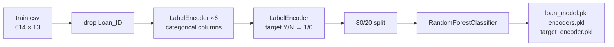

<div align="center">


</div>

---

> **ShadowFox Python Internship — Task 2.** A random forest predicting loan approval from
> 614 applications, with every fitted `LabelEncoder` saved so that inference can reproduce
> the exact training-time encoding.

All numbers below were reproduced by re-running [main.py](main.py)'s pipeline on the
committed [train.csv](train.csv).

---

## Measured results

80/20 split, `random_state=42`, `RandomForestClassifier(random_state=42)` with defaults:

| Metric | Value |
|---|---:|
| Test accuracy | **78.05 %** |
| Majority-class baseline | 68.73 % |
| Lift over baseline | **+9.3 points** |

The baseline matters. The target is imbalanced — **422 approved (Y) to 192 rejected (N)** —
so a model that blindly approved every application would already score 68.73 %. The forest's
real contribution is the 9.3-point gap, not the 78 % headline.

### What drives the decision

Random forest feature importances, top five of eleven:

| Feature | Importance |
|---|---:|
| `Credit_History` | 0.273 |
| `LoanAmount` | 0.189 |
| `ApplicantIncome` | 0.184 |
| `CoapplicantIncome` | 0.097 |
| `Loan_Amount_Term` | 0.055 |

Credit history alone carries more weight than any other single feature, and the top three —
credit, loan size and income — account for **65 %** of the model. The demographic columns
(`Gender`, `Married`, `Education`, `Self_Employed`, `Property_Area`) contribute comparatively
little, which is a reassuring result for a lending model.

---

## Pipeline



`Loan_ID` is dropped first — it is a unique identifier, and leaving it in would give the
forest a column that perfectly indexes every training row.

**Three artifacts are saved, not one.** This is the detail worth copying:

```python
joblib.dump(model,          "loan_model.pkl")
joblib.dump(encoders,       "encoders.pkl")        # dict of 6 fitted LabelEncoders
joblib.dump(target_encoder, "target_encoder.pkl")  # for decoding predictions back to Y/N
```

A `LabelEncoder` assigns integers by sorted order of the values it saw during `fit`. Re-fitting
one at inference time on different data silently produces a different mapping and therefore
wrong predictions. Persisting the fitted encoders is what makes [predict.py](predict.py)
correct.

---

## Two data-handling caveats

### 1 · Numeric missing values are never imputed

`train.csv` contains **149 missing values**. The encoding loop covers only the six
categorical columns, so after preprocessing **86 NaNs remain** in the feature matrix:

| Column | Remaining NaNs |
|---|---:|
| `Credit_History` | 50 |
| `LoanAmount` | 22 |
| `Loan_Amount_Term` | 14 |

This is a portability hazard. `RandomForestClassifier` only gained native NaN support in
scikit-learn 1.4 — **on any earlier version this script raises**
`ValueError: Input contains NaN`. On 1.4+ it trains fine, which is how the 78.05 % above was
measured. Note that the most-affected column, `Credit_History`, is also the model's single
most important feature.

Adding one line before the split makes it version-independent:

```python
X = X.fillna(X.median())
```

### 2 · `.astype(str)` turns missing categoricals into a real category

```python
data[col] = le.fit_transform(data[col].astype(str))
```

For the categorical columns this converts `NaN` into the literal string `'nan'`, which the
encoder then treats as a legitimate class alongside `Male`/`Female`. It is a defensible
choice — "unknown" can genuinely be predictive in lending — but it is implicit rather than
declared, and worth being aware of when interpreting the encoders.

---

## Repository contents

| File | Role |
|---|---|
| [main.py](main.py) | Full training pipeline; prints accuracy and saves all three artifacts. |
| [predict.py](predict.py) | Loads the model and encoders to score a new application. |
| [train.csv](train.csv) | 614 loan applications, 13 columns. |
| `loan_model.pkl` · `encoders.pkl` · `target_encoder.pkl` | Saved artifacts. |
| [Figure_1.png](Figure_1.png) | Generated plot. |

---

## Running it

```bash
pip install pandas scikit-learn joblib
python main.py
```

Output:

```
Accuracy: 0.7804878048780488
Model and encoders saved successfully.
```

Requires scikit-learn ≥ 1.4 unless you add the imputation line above.

---

## Related repositories

| Repository | Contents |
|---|---|
| [shadow-fox-](https://github.com/darshanniphade/shadow-fox-) | All three internship tasks together. Its `task2/` is byte-identical to this repository. |
| [shadowfox-project-1](https://github.com/darshanniphade/shadowfox-project-1) | Task 1 — Boston house price regression. |

The previous README is preserved as [README.old.md](README.old.md).

---

## Author

**Darshan Anil Niphade** — ShadowFox Python Internship
